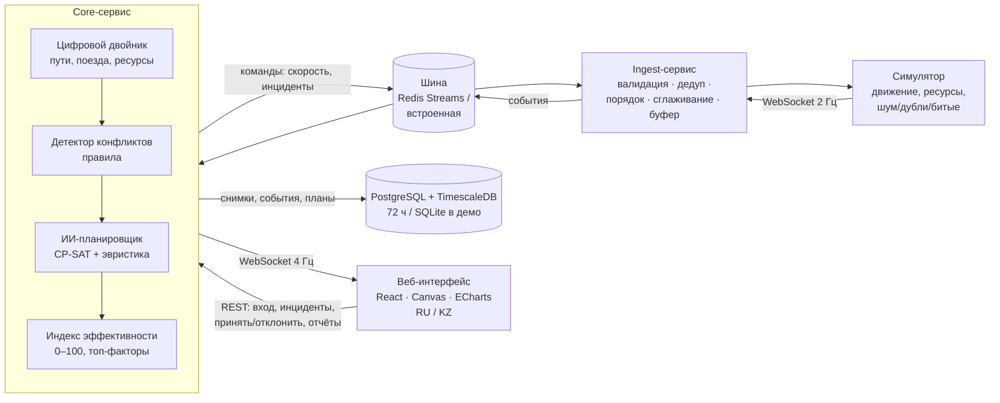

# Архитектура «Цифровая станция Актогай»



| Компонент | Технология | Ответственность |
|---|---|---|
| Симулятор | Python, websockets | Поток событий 2 Гц, шум, дубли, битые сообщения, reconnect с backoff |
| Ingest | FastAPI WS | Валидация (pydantic), дедупликация (LRU), отбрасывание запоздавших, EMA-сглаживание координат, буфер |
| Шина | Redis Streams / asyncio | Развязка сервисов, backpressure |
| Двойник | Python | Исполняет принятый план: приём на путь, операции, отправление |
| Конфликты | правила | Закрытый путь, отказ стрелки, занятость пути, враждебные маршруты, нехватка ресурсов, простой у сигнала |
| Планировщик | OR-Tools CP-SAT | Назначение путей и времени, NoOverlap по путям и горловинам, Cumulative по ресурсам; 3 варианта; резерв — эвристика |
| Индекс | Python | Формула и пороги в `config/index.json`, меняются без перекомпиляции |
| Хранилище | TimescaleDB | История 72 ч, перемотка, отчёты |
| UI | React + TS | Схема станции, Гант, проблемы→решения, индекс, перемотка, отчёт |

**Принцип СППР:** система предлагает — дежурный по станции (ДСП) подтверждает. Доступа к СЦБ нет.

## Формула индекса
```
Индекс = 0,25·Пропускная способность + 0,25·Соблюдение графика + 0,20·Конфликты
       + 0,15·Загрузка путей + 0,15·Простой ресурсов
Норма ≥ 80 · Внимание 60–79 · Критично < 60
```
Каждый фактор 0–100:
- Пропускная способность = 100 · отправлено за час / по графику за час;
- Соблюдение графика = 100 − 4 · среднее отклонение отправления (мин);
- Конфликты = 100 − 25 · критичные − 10 · предупреждения;
- Загрузка путей = 100, если загрузка ≤ 75 %, далее линейно до 0 при 100 %;
- Простой = 100 − 2 · средний простой поезда (мин).

## Модель планировщика (CP-SAT)
Переменные: путь поезда `x[t,k]`, прибытие `a_t ≥ ETA`, отправление `d_t ≥ a_t + стоянка`.
Ограничения: специализация и полезная длина путей; NoOverlap занятости каждого пути (+3 мин на освобождение);
NoOverlap движений в каждой горловине (интервал 2 мин); закрытый путь и отказ стрелки — через `OnlyEnforceIf`;
Cumulative для осмотрщиков ПТО (40 мин), локомотивов (30 мин), локомотивных бригад (15 мин);
пассажирский не отправляется раньше графика.
Цель: Σ вес·опоздание + 0,3·вес·ожидание у сигнала + штрафы за неспециализированный путь + штраф за изменение пути.
Веса: пассажирский 10, контейнерный 4, грузовой 2. Лимит решения 2 с (требование ≤ 5 с), факт ~30 мс.
